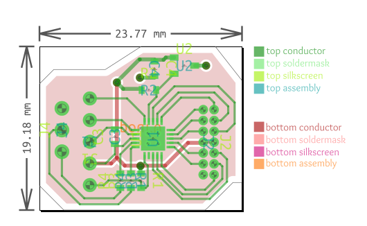

# PCBupvE
Upverter Conversion Tool for PCBmodE


### The hook

PCBmodE is an unusual ECAD package that doesn't know nets, traces, or even schematics. It's a collection of JSON files that get converted into SVG or gerber files.

There are some limited tools to convert SVG files back into JSON, too. Consider it like forward- and back-annotation.

The end takeaway is that these circuits are _drawn_, not engineered.

### The problem

Because PCBmodE has no concept of schematics or netlists, doing complex circuits is a non-starter.
Wiring up LEDs to batteries is one thing, but complex fanouts from large microcontrollers is difficult, to put it mildly.


### A solution

This is a conversion tool to Upverter's OpenJSON format and turn it into a set of board files that PCBmodE can read.

### Status

It largely works. There are some coordinate issues that will go away after some investigation.

Not all elements are supported yet - Currently only components, component instances, vias, traces, outlines.

Silkscreens, shapes, designators, and metadata are all totally possible.

This also dumps all of the JSON files into a single folder. That should be changed to the proper directory structure.


### Installation

The latest dev branch of PCBmodE must be installed.

`pip install git+https://github.com/threebytesfull/pcbmode.git@improve-test-coverage`

Then clone and run this repo on the sample inputs:
```
git clone https://github.com/JarrettR/PCBupvE.git
cd PCBupvE
python main.py -f .\test_data\688cbc7ec09544c0_15226514270000_openjson.upv
```

The following output should happen:
```
Input file loaded, OpenJSON format version: 0.3.0

Processing categories...

component_instances     - 11 component instances processed of 23
components              - 14 components processed of 16
design_attributes       - Not yet implemented
layer_options           - Not yet implemented
layout_bodies           - Not yet implemented
layout_body_attributes  - Not yet implemented
layout_objects          - 4 vias processed
module_instances        - Not yet implemented
modules                 - Not yet implemented
named_regions           - Not yet implemented
nets                    - 52 nets unprocessed, still todo
paths                   - 1 paths processed of 1
pcb_text                - Not yet implemented
pins                    - Not yet implemented
pours                   - Not yet implemented
rulers                  - Not yet implemented
shape_poses             - Not yet implemented
shapes                  - Not yet implemented
trace_segments          - 124 trace_segments processed
version                 - Nothing to be done
Done!
```

And you'll have a selection of JSON files in the output folder.

All of the hex names should be dragged into `boards\yourboard\components\`

Rename and drag `default.json` to `boards\yourboard\yourboard.json`

Rename and drag `routes.json` to `boards\yourboard\yourboard_routes.json`


Run PCBmodE from the parent of your board directory:

`pcbmode -b yourboard -m`

And continue on your PCBmodE workflow! An SVG should have been generated in `boards\yourboard\build\yourboard.svg`

### Images

Original Test:


Physical board:


Upverter Test PCB:


Converted SVG:


 
 

### More Information

 https://jrainimo.com/build/?p=1672
